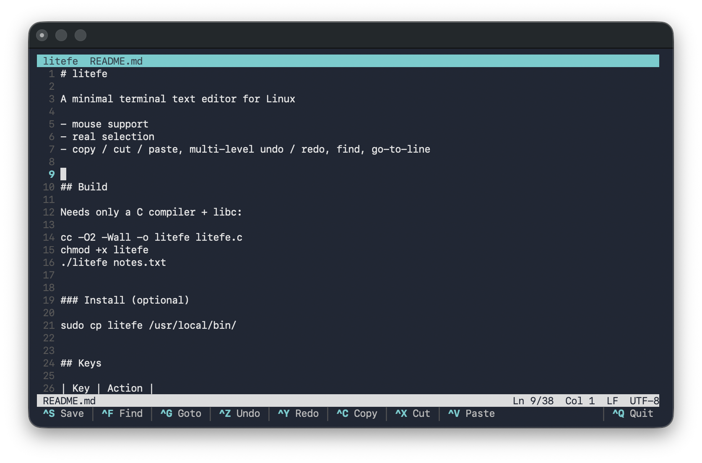

# litefe

A minimal terminal text editor for Linux

- mouse support
- real selection
- copy / cut / paste, multi-level undo / redo, find, go-to-line

## Build

Needs only a C compiler + libc:

cc -O2 -Wall -o litefe litefe.c
chmod +x litefe
./litefe notes.txt

### Install (optional)

sudo cp litefe /usr/local/bin/

## Keys

| Key | Action |
|-----|--------|
| `Ctrl-S` / `Ctrl-Q` | save / quit |
| `Ctrl-F` · `Ctrl-N`/`F3` | find · find next |
| `Ctrl-G` | go to line |
| `Ctrl-C` `Ctrl-X` `Ctrl-V` `Ctrl-A` | copy · cut · paste · select all |
| `Ctrl-Z` / `Ctrl-Y` | undo / redo |
| `Ctrl-D` / `Ctrl-K` | duplicate line · cut line |
| `Shift`+arrows | select · `Ctrl`+`Left`/`Right` word jump |
| `F1` | help |
| `F2` | toggle in-app mouse |

Press **`F1`** inside the editor for the full list.
